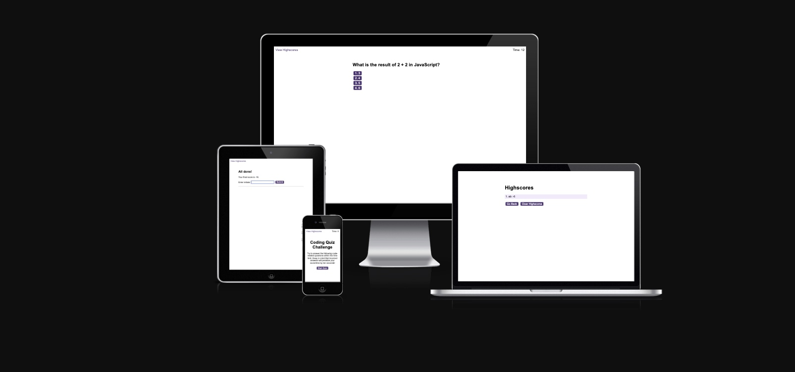

# JS Trivia Quiz

[link to the deployed page](https://abbyedxcmk.github.io/trivia-quiz/)

## Results

This is the final application made by our code:

[link to the Github Pages](https://abbyedxcmk.github.io/trivia-quiz/)

[link to the Github Repo](https://github.com/abbyedxcmk/trivia-quiz)

## Overview

In this challenge, we had a real-world situation. We were tasked with creating code in JavaScript for  creating a timed quiz on JavaScript fundamentals that stores high scores.

We also added the sound option for correct and incorrect choices.

